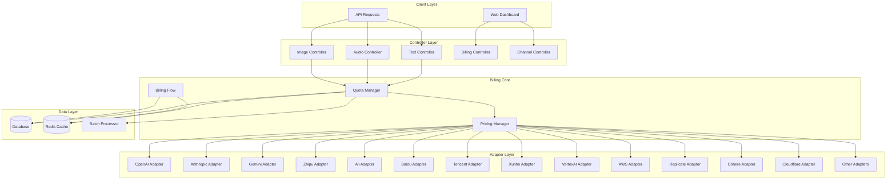
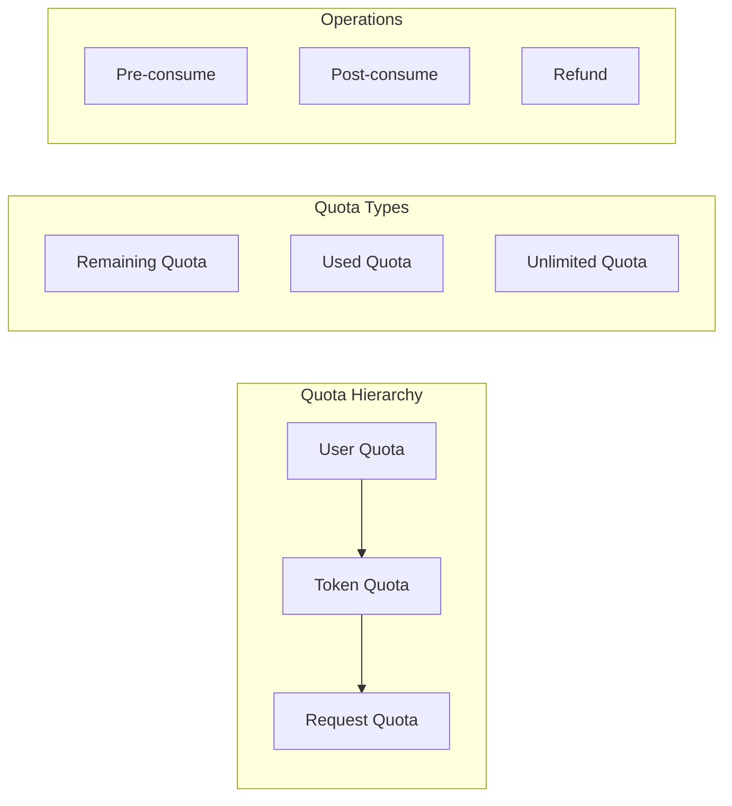
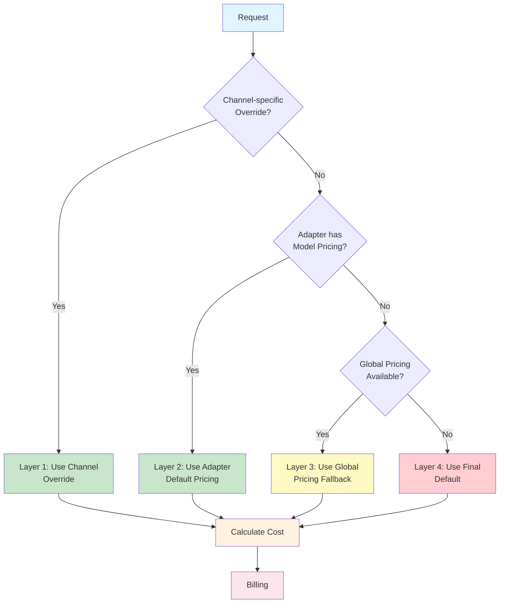
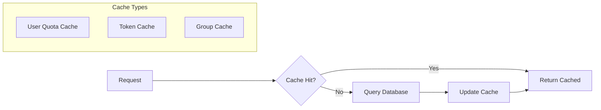
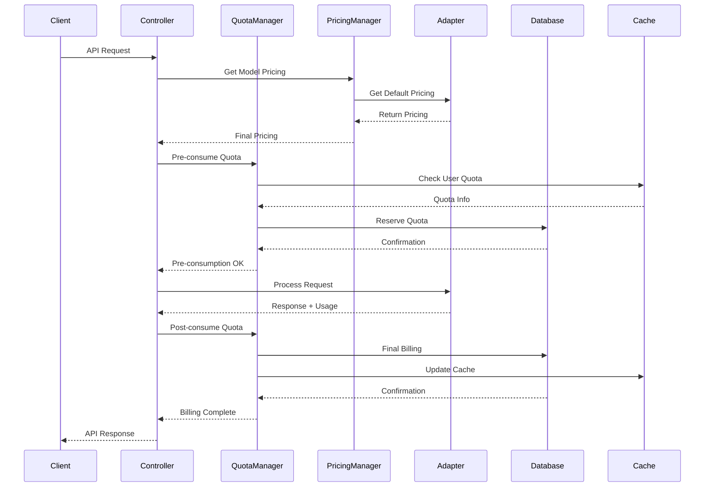
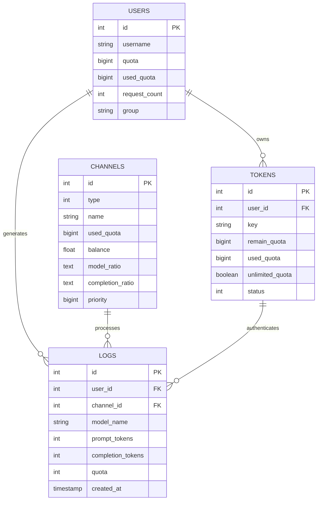
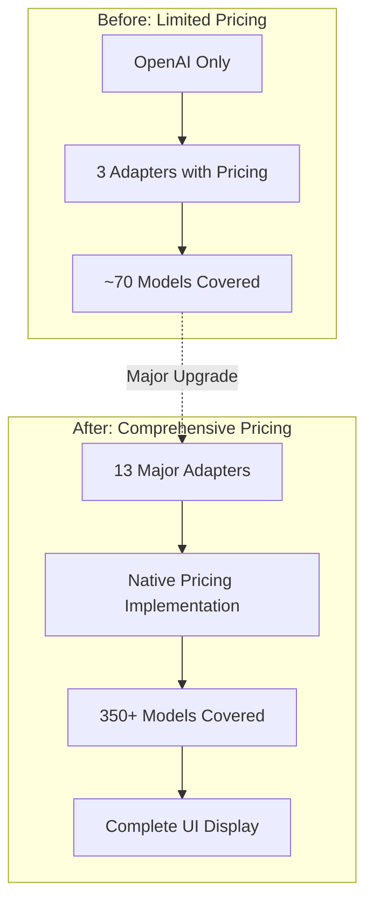
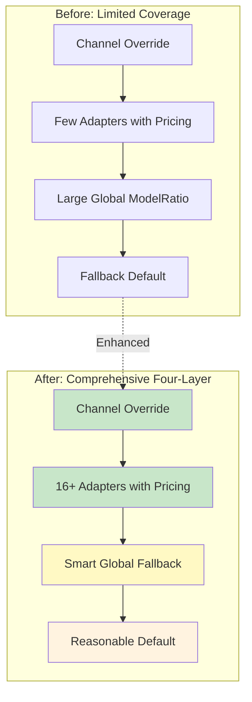
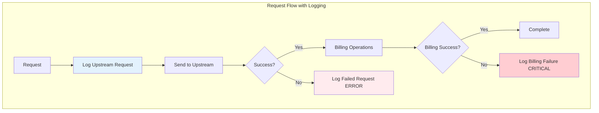

# One-API Billing System Architecture

## Table of Contents

- [One-API Billing System Architecture](#one-api-billing-system-architecture)
  - [Table of Contents](#table-of-contents)
  - [Overview](#overview)
    - [Key Features](#key-features)
  - [System Architecture](#system-architecture)
  - [Core Components](#core-components)
    - [1. Quota Management System](#1-quota-management-system)
      - [Key Files](#key-files)
    - [2. Pricing System](#2-pricing-system)
      - [Key Files](#key-files-1)
    - [3. Adapter System](#3-adapter-system)
      - [Adapter Pricing Implementation Status](#adapter-pricing-implementation-status)
  - [Quota Management](#quota-management)
    - [User Quota System](#user-quota-system)
      - [Database Schema (User)](#database-schema-user)
      - [Key Operations](#key-operations)
    - [Token Quota System](#token-quota-system)
      - [Database Schema (Token)](#database-schema-token)
      - [Token Types](#token-types)
    - [Caching Strategy](#caching-strategy)
      - [Key Files](#key-files-2)
  - [Pricing System](#pricing-system)
    - [Pricing Hierarchy](#pricing-hierarchy)
    - [Pricing Constants](#pricing-constants)
    - [Model Pricing Structure](#model-pricing-structure)
    - [Global Pricing System](#global-pricing-system)
      - [Architecture](#architecture)
      - [Configuration](#configuration)
      - [Key Functions](#key-functions)
      - [Conflict Resolution](#conflict-resolution)
    - [Channel-specific Pricing](#channel-specific-pricing)
      - [Database Schema (Channel)](#database-schema-channel)
      - [Key Functions](#key-functions-1)
  - [Billing Flow](#billing-flow)
    - [Request Processing Flow](#request-processing-flow)
    - [Pre-consumption Phase](#pre-consumption-phase)
      - [Key Functions](#key-functions-2)
    - [Post-consumption Phase](#post-consumption-phase)
      - [Key Functions](#key-functions-3)
    - [Quota Calculation](#quota-calculation)
      - [Text Requests](#text-requests)
      - [Audio Requests](#audio-requests)
      - [Image Requests](#image-requests)
  - [Database Schema](#database-schema)
    - [Core Tables](#core-tables)
      - [Users Table](#users-table)
      - [Tokens Table](#tokens-table)
      - [Channels Table](#channels-table)
      - [Logs Table](#logs-table)
    - [Relationships](#relationships)
  - [API Endpoints](#api-endpoints)
    - [Billing Endpoints](#billing-endpoints)
      - [Get Subscription Info](#get-subscription-info)
      - [Get Usage Info](#get-usage-info)
    - [Channel Pricing Endpoints](#channel-pricing-endpoints)
      - [Get Channel Pricing](#get-channel-pricing)
      - [Update Channel Pricing](#update-channel-pricing)
      - [Get Default Pricing](#get-default-pricing)
  - [Testing \& Race Condition Policy (2025-08)](#testing--race-condition-policy-2025-08)
    - [Token Management Endpoints](#token-management-endpoints)
  - [Recent Pricing Implementation Improvements](#recent-pricing-implementation-improvements)
    - [Comprehensive Adapter Pricing Implementation](#comprehensive-adapter-pricing-implementation)
      - [Implementation Overview](#implementation-overview)
      - [Key Improvements](#key-improvements)
      - [Technical Implementation Details](#technical-implementation-details)
      - [Provider-Specific Pricing Examples](#provider-specific-pricing-examples)
      - [Migration from DefaultPricingMethods](#migration-from-defaultpricingmethods)
      - [Impact and Benefits](#impact-and-benefits)
      - [Files Modified](#files-modified)
    - [Global Pricing Enhancement and Clean Architecture](#global-pricing-enhancement-and-clean-architecture)
      - [Architecture Transformation](#architecture-transformation)
      - [What Was Enhanced](#what-was-enhanced)
      - [What Was Preserved](#what-was-preserved)
      - [Benefits Achieved](#benefits-achieved)
  - [Implementation Details](#implementation-details)
    - [Current Implementation Status](#current-implementation-status)
    - [Four-Layer Pricing Resolution](#four-layer-pricing-resolution)
      - [Legacy Compatibility](#legacy-compatibility)
    - [Batch Processing](#batch-processing)
      - [Configuration](#configuration-1)
      - [Batch Types](#batch-types)
      - [Key Files](#key-files-3)
    - [Error Handling and Recovery](#error-handling-and-recovery)
      - [Quota Refund Mechanism](#quota-refund-mechanism)
      - [Key Files](#key-files-4)
    - [Structured Output Pricing](#structured-output-pricing)
      - [Key Files](#key-files-5)
  - [Performance Considerations](#performance-considerations)
    - [Caching Strategy](#caching-strategy-1)
    - [Database Optimization](#database-optimization)
    - [Memory Management](#memory-management)
    - [Monitoring and Metrics](#monitoring-and-metrics)
      - [Key Metrics](#key-metrics)
      - [Monitoring Files](#monitoring-files)
  - [Unbilled Request Logging System](#unbilled-request-logging-system)
    - [Logging Overview](#logging-overview)
    - [Implementation](#implementation)
    - [Log Levels and Keywords](#log-levels-and-keywords)
    - [Coverage Analysis](#coverage-analysis)
    - [Key Files](#key-files-6)
  - [Summary](#summary)

## Overview

The One-API billing system is a comprehensive quota and pricing management system designed to handle multi-tenant API usage billing across various AI model providers. The system supports both user-level and token-level quota management, channel-specific pricing, and real-time billing calculations.

**Current System Status (2025)**: The billing system now features comprehensive pricing coverage with 25+ adapters supporting 400+ models across major AI providers, implementing a sophisticated four-layer pricing resolution system with intelligent global fallback capabilities.

### Key Features

- **Multi-tier Quota System**: User quotas, token quotas, and unlimited quota support
- **Channel-specific Pricing**: Per-channel model pricing overrides
- **Comprehensive Adapter Pricing**: 25+ channel adapters with native pricing implementations
- **Complete Pricing Coverage**: 400+ models across major AI providers with accurate pricing
- **Four-Layer Pricing System**: Channel overrides → Adapter pricing → Global fallback → Final default
- **Real-time Billing**: Pre-consumption and post-consumption quota management
- **Caching Layer**: Redis-based caching for performance optimization
- **Batch Updates**: Configurable batch processing for high-throughput scenarios
- **Zero-Loss Pricing Display**: All completion ratios (including 0) are displayed in the UI

## System Architecture



## Core Components

### 1. Quota Management System

The quota management system operates on multiple levels:



#### Key Files

- `model/user.go` - User quota management
- `model/token.go` - Token quota management
- `model/cache.go` - Quota caching layer
- `relay/billing/billing.go` - Core billing operations

### 2. Pricing System

The pricing system uses a hierarchical approach with three fallback levels:



#### Key Files

- `relay/pricing/global.go` - Global pricing manager and four-layer pricing logic
- `relay/billing/ratio/model.go` - Audio/video pricing constants and legacy compatibility functions
- `relay/adaptor/interface.go` - Adapter pricing interface
- `relay/adaptor/*/constants.go` - Adapter-specific pricing implementations (25+ adapters)
- `model/channel.go` - Channel-specific pricing storage
- `controller/channel.go` - Channel pricing API endpoints

### 3. Adapter System

All channel adapters now use a unified, centralized pricing logic. As of July 2025, 25+ major adapters import and use a shared `ModelRatios` constant from their respective `constants.go` or subadaptor, eliminating local, hardcoded pricing maps and ensuring consistency across the system. **All pricing, quota, and billing calculations are standardized to use "per 1M tokens" (1 million tokens) as the pricing unit. All user-facing documentation and UI must use this unit.**

**All adapters must use the shared `ModelRatios` map as the single source of truth for model pricing. Local pricing maps are deprecated.**

For unknown models, all adapters use a unified fallback (e.g., `5 * ratio.MilliTokensUsd`). This ensures that even if a model is missing from the shared map, it will still be billed with a reasonable default. VertexAI pricing is aggregated from all subadapters (Claude, Imagen, Gemini, Veo) and includes VertexAI-specific models. Any omission in a subadapter will propagate to VertexAI.

Model lists are always derived from the keys of the shared pricing maps, ensuring pricing and support are always in sync.

**Key interface:**

```go
type Adaptor interface {
    GetDefaultModelPricing() map[string]ModelConfig
    GetModelRatio(modelName string) float64
    GetCompletionRatio(modelName string) float64
}
```

**Implementation details:**

- Each adapter's `GetDefaultModelPricing()` returns the shared `ModelRatios` map, which is the single source of truth for model pricing.
- Model lists are always derived from the keys of the shared pricing maps, ensuring pricing and support are always in sync.
- All adapters use a unified fallback (e.g., `5 * ratio.MilliTokensUsd`) for unknown models.
- VertexAI pricing is aggregated from all subadaptors (Claude, Imagen, Gemini, Veo) and includes VertexAI-specific models. Any omission in a subadaptor will propagate to VertexAI.
- All pricing, quota, and billing calculations are standardized to use "per 1M tokens" (1 million tokens) instead of "per 1K tokens". This is reflected in all code, comments, and documentation. Double-check all user-facing messages and documentation for consistency.

**Adapters with Native Pricing (25+ total):**

- OpenAI, Anthropic, Zhipu, Ali (Alibaba), Baidu, Tencent, Gemini, Xunfei, VertexAI, DeepSeek, Groq, Mistral, Moonshot, Cohere, AI360, Doubao, Novita, OpenRouter, Replicate, AWS, StepFun, LingYi WanWu, Minimax, Baichuan, TogetherAI, SiliconFlow, XAI

**Adapters using DefaultPricingMethods (fallback only):**

- Ollama, Coze, DeepL

All adapters now follow the same four-layer pricing system and fallback logic, with no local pricing map drift.

#### Adapter Pricing Implementation Status

**✅ Adapters with Native Pricing (25+ total)**:

- **OpenAI**: 84 models with comprehensive GPT pricing
- **Anthropic**: 15 models with Claude pricing
- **Zhipu**: 23 models with GLM pricing
- **Ali (Alibaba)**: 89 models with Qwen and other models
- **Baidu**: 16 models with ERNIE pricing
- **Tencent**: 6 models with Hunyuan pricing
- **Gemini**: 26 models with Gemini/Gemma pricing
- **Xunfei**: 6 models with Spark pricing
- **VertexAI**: 34 models with Google Cloud pricing
- **DeepSeek**: 2 models with DeepSeek pricing
- **Groq**: 20+ models with Groq pricing
- **Mistral**: 10+ models with Mistral pricing
- **Moonshot**: 3 models with Moonshot pricing
- **Cohere**: 12 models with Command pricing
- **AI360**: 4 models with AI360 pricing
- **Doubao**: 20+ models with Doubao pricing
- **Novita**: 40+ models with Novita pricing
- **OpenRouter**: 100+ models with comprehensive multi-provider pricing
- **Replicate**: 48 models with image generation and language models
- **AWS**: 31 models with Bedrock pricing
- **StepFun**: 3 models with Step pricing
- **LingYi WanWu**: 3 models with Yi pricing
- **Minimax**: 3 models with abab pricing
- **Baichuan**: 2 models with Baichuan pricing
- **TogetherAI**: 40+ models with Together AI pricing
- **SiliconFlow**: 30+ models with SiliconFlow pricing
- **XAI**: 2 models with Grok pricing

**❌ Adapters Using DefaultPricingMethods (3 remaining)**:

- **Ollama**: Local model hosting (typically free)
- **Coze**: Conversational AI platform
- **DeepL**: Translation service

## Quota Management

### User Quota System

Users have a primary quota that serves as the main billing account:

#### Database Schema (User)

```sql
CREATE TABLE users (
    id INTEGER PRIMARY KEY,
    quota BIGINT DEFAULT 0,           -- Remaining quota
    used_quota BIGINT DEFAULT 0,     -- Total used quota
    request_count INTEGER DEFAULT 0   -- Total request count
);
```

#### Key Operations

- `IncreaseUserQuota()` - Add quota to user account
- `DecreaseUserQuota()` - Deduct quota from user account
- `GetUserQuota()` - Retrieve current user quota
- `CacheGetUserQuota()` - Cached quota retrieval

### Token Quota System

Tokens can have individual quotas or inherit from user quotas:

#### Database Schema (Token)

```sql
CREATE TABLE tokens (
    id INTEGER PRIMARY KEY,
    user_id INTEGER,
    remain_quota BIGINT DEFAULT 0,    -- Token-specific quota
    used_quota BIGINT DEFAULT 0,      -- Token usage
    unlimited_quota BOOLEAN DEFAULT FALSE  -- Bypass quota checks
);
```

#### Token Types

1. **Limited Tokens**: Have specific quota limits
2. **Unlimited Tokens**: Bypass quota restrictions
3. **User-inherited Tokens**: Use parent user's quota

### Caching Strategy

The system implements a multi-layer caching strategy for performance:



#### Key Files

- `model/cache.go` - Caching implementations
- Cache TTL configurations in `model/cache.go`

## Pricing System

### Pricing Hierarchy

The system uses a **comprehensive four-layer pricing hierarchy** to handle custom channels and unknown models:

1. **User Custom Ratio** (Channel-specific overrides) - Highest Priority
2. **Channel Default Ratio** (Adapter's default pricing) - Second Priority
3. **Global Pricing Fallback** (Merged from selected adapters) - Third Priority
4. **Final Default** (Reasonable fallback) - Lowest Priority

This four-layer approach ensures that custom channels with common models can automatically receive appropriate pricing even when the channel adapter doesn't have specific pricing for those models. The global pricing system merges pricing from 13 major adapters to provide comprehensive fallback coverage.

### Pricing Constants

```go
// Currency and token conversion constants
const (
    QuotaPerUsd     = 500000 // $1 = 500,000 quota
    MilliTokensUsd  = 0.5    // 0.5 quota per milli-token (0.000001 USD * 500000)
    ImageUsdPerPic  = 1000   // 1000 quota per image (0.002 USD * 500000)
    MilliTokensRmb  = 3.5    // 3.5 quota per milli-token (0.000007 RMB * 500000)
    ImageRmbPerPic  = 7000   // 7000 quota per image (0.014 RMB * 500000)
    MilliTokensYuan = 3.5    // 3.5 quota per milli-token (0.000007 Yuan * 500000)
    ImageYuanPerPic = 7000   // 7000 quota per image (0.014 Yuan * 500000)
    TokensPerSec    = 10     // Video tokens per second for video generation models
)
```

### Model Pricing Structure

```go
type ModelConfig struct {
    Ratio             float64 `json:"ratio"`
    CompletionRatio   float64 `json:"completion_ratio,omitempty"`
    // Cached reads (cache hit/refresh)
    CachedInputRatio  float64 `json:"cached_input_ratio,omitempty"`
    // Cache writes (cache creation)
    CacheWrite5mRatio float64 `json:"cache_write_5m_ratio,omitempty"`
    CacheWrite1hRatio float64 `json:"cache_write_1h_ratio,omitempty"`
}
```

### Global Pricing System

The global pricing system provides a third layer of pricing fallback for custom channels that offer common models but don't have specific pricing defined in their adapters.

#### Architecture

The global pricing manager automatically merges pricing from selected adapters on startup:

```go
type GlobalPricingManager struct {
    globalModelPricing    map[string]adaptor.ModelConfig
    contributingAdapters  []int // API types to include
    getAdaptorFunc        func(apiType int) adaptor.Adaptor
}
```

#### Configuration

Global pricing adapters are defined as a simple slice in the code for easy modification:

```go
// DefaultGlobalPricingAdapters defines which adapters contribute to global pricing fallback
var DefaultGlobalPricingAdapters = []int{
    apitype.OpenAI,    // Comprehensive GPT models with pricing
    apitype.Anthropic, // Claude models with pricing
    apitype.Gemini,    // Google Gemini models with pricing
    apitype.Ali,       // Alibaba Qwen models with pricing
    apitype.Baidu,     // Baidu ERNIE models with pricing
    apitype.Zhipu,     // Zhipu GLM models with pricing
    apitype.DeepSeek,  // DeepSeek models with pricing
    apitype.Groq,      // Groq models with pricing
    apitype.Mistral,   // Mistral models with pricing
    apitype.Moonshot,  // Moonshot models with pricing
    apitype.Cohere,    // Cohere models with pricing
    apitype.Tencent,   // Tencent Hunyuan models with pricing
    apitype.Xunfei,    // Xunfei Spark models with pricing
}
```

#### Key Functions

- `GetModelRatioWithThreeLayers()` - Four-layer pricing resolution
- `GetCompletionRatioWithThreeLayers()` - Four-layer completion ratio resolution
- `SetContributingAdapters()` - Configure which adapters contribute to global pricing
- `ReloadGlobalPricing()` - Force reload of global pricing from adapters
- `GetGlobalPricingStats()` - Get statistics about global pricing coverage

#### Conflict Resolution

When multiple adapters define pricing for the same model, the first adapter in the configuration list takes precedence. Conflicts are logged for transparency.

### Channel-specific Pricing

Channels can override default pricing for specific models:

#### Database Schema (Channel)

```sql
CREATE TABLE channels (
    id INTEGER PRIMARY KEY,
    model_ratio TEXT,        -- JSON: {"model": ratio}
    completion_ratio TEXT    -- JSON: {"model": completion_ratio}
);
```

#### Key Functions

- `GetModelRatio()` - Retrieve channel model pricing
- `SetModelRatio()` - Update channel model pricing
- `GetCompletionRatio()` - Retrieve completion pricing
- `SetCompletionRatio()` - Update completion pricing

## Billing Flow

### Request Processing Flow



### Pre-consumption Phase

Before processing requests, the system reserves quota:

#### Key Functions

- `preConsumeQuota()` in `relay/controller/text.go`
- `getPreConsumedQuota()` for quota calculation
- Token validation and quota checking

### Post-consumption Phase

After request completion, final billing is calculated:

#### Key Functions

- `postConsumeQuota()` in `relay/controller/helper.go`
- `PostConsumeQuota()` in `relay/billing/billing.go`
- Usage logging and metrics recording

### Quota Calculation

Different request types use different calculation methods:

#### Text Requests

Base formula (no caching):

```
quota = (prompt_tokens + completion_tokens * completion_ratio) * model_ratio * group_ratio
```

Claude prompt caching extends billing with cache-read and cache-write costs. We split prompt tokens into: normal input, cached-read input, and cache-write input (5m and 1h). Completion tokens may also be cached by some providers.

```
normal_input = prompt_tokens - cached_read - cache_write_5m - cache_write_1h

quota =
    normal_input        * input_price
+ cached_read         * cached_input_price
+ noncached_completion* output_price
    # Note: we do not bill cached completion tokens. Providers do not return cached completion metrics and there is no CachedOutputRatio.
+ cache_write_5m      * write5m_price
+ cache_write_1h      * write1h_price

where:
    input_price           = model_ratio * group_ratio
    output_price          = model_ratio * completion_ratio * group_ratio
    cached_input_price    = (CachedInputRatio if >0 else input_price) or 0 if <0
    # No cached output price; completions are always billed at output_price
    write5m_price         = (CacheWrite5mRatio if >0 else input_price) or 0 if <0
    write1h_price         = (CacheWrite1hRatio if >0 else input_price) or 0 if <0
```

Notes:

- We prevent double-charging by subtracting cache-write tokens from the normal-input bucket; values are clamped to avoid negatives if upstream reports inconsistent totals.
- For Anthropic Claude, cached-read tokens come from `usage.cache_read_input_tokens`. Cache-write tokens come from `usage.cache_creation.ephemeral_5m_input_tokens` and `usage.cache_creation.ephemeral_1h_input_tokens` (or the legacy `cache_creation_input_tokens`). See `docs/refs/claude_prompt_caching.md`.

#### Audio Requests

```
quota = audio_duration_seconds * audio_tokens_per_second * model_ratio * group_ratio
```

#### Image Requests

```
quota = image_count * image_cost_per_pic * model_ratio * group_ratio
```

## Database Schema

### Core Tables

#### Users Table

```sql
CREATE TABLE users (
    id INTEGER PRIMARY KEY AUTOINCREMENT,
    username VARCHAR(30) UNIQUE,
    quota BIGINT DEFAULT 0,
    used_quota BIGINT DEFAULT 0,
    request_count INTEGER DEFAULT 0,
    group VARCHAR(32) DEFAULT 'default'
);
```

#### Tokens Table

```sql
CREATE TABLE tokens (
    id INTEGER PRIMARY KEY AUTOINCREMENT,
    user_id INTEGER,
    key CHAR(48) UNIQUE,
    remain_quota BIGINT DEFAULT 0,
    used_quota BIGINT DEFAULT 0,
    unlimited_quota BOOLEAN DEFAULT FALSE,
    status INTEGER DEFAULT 1,
    expired_time BIGINT DEFAULT -1
);
```

#### Channels Table

```sql
CREATE TABLE channels (
    id INTEGER PRIMARY KEY AUTOINCREMENT,
    type INTEGER DEFAULT 0,
    name VARCHAR(255),
    used_quota BIGINT DEFAULT 0,
    balance FLOAT DEFAULT 0,
    model_ratio TEXT,           -- JSON string
    completion_ratio TEXT,      -- JSON string
    priority BIGINT DEFAULT 0
);
```

#### Logs Table

```sql
CREATE TABLE logs (
    id INTEGER PRIMARY KEY AUTOINCREMENT,
    user_id INTEGER,
    channel_id INTEGER,
    model_name VARCHAR(255),
    prompt_tokens INTEGER,
    completion_tokens INTEGER,
    cached_prompt_tokens INTEGER,         -- Persisted cached prompt tokens (2025-08)
    quota INTEGER,
    created_at TIMESTAMP DEFAULT CURRENT_TIMESTAMP
);
```

**Note:**

- The backend log API returns `cached_prompt_tokens` for each log entry. The frontend shows cached prompt tokens as a tooltip in the Prompt column.
- Cache-write token amounts are available at runtime in the usage object (`cache_write_5m_tokens`, `cache_write_1h_tokens`) and are billed accordingly. Persisting them to logs can be added later if needed.

### Relationships



## API Endpoints

### Billing Endpoints

#### Get Subscription Info

```
GET /dashboard/billing/subscription
GET /v1/dashboard/billing/subscription
```

**Controller**: `controller.GetSubscription()`
**File**: `controller/billing.go`

#### Get Usage Info

```
GET /dashboard/billing/usage
GET /v1/dashboard/billing/usage
```

**Controller**: `controller.GetUsage()`
**File**: `controller/billing.go`

### Channel Pricing Endpoints

#### Get Channel Pricing

```
GET /api/channel/pricing/:id
```

**Controller**: `controller.GetChannelPricing()`
**File**: `controller/channel.go`

#### Update Channel Pricing

```
PUT /api/channel/pricing/:id
```

**Controller**: `controller.UpdateChannelPricing()`
**File**: `controller/channel.go`

#### Get Default Pricing

```
GET /api/channel/default-pricing?type=:channelType
```

**Controller**: `controller.GetChannelDefaultPricing()`
**File**: `controller/channel.go`

**Response Format**:

```json
{
  "success": true,
  "message": "",
  "data": {
    "model_ratio": "{\"model1\": 0.001, \"model2\": 0.002}",
    "completion_ratio": "{\"model1\": 1.0, \"model2\": 3.0}",
    "cached_prompt_tokens": 123 // (in log API responses)
  }
}
```

**Frontend:**

- The logs table displays these cached token fields as tooltips in the Prompt/Completion columns for each log entry.

## Testing & Race Condition Policy (2025-08)

- All changes must pass `go test -race ./...` before merge. Any test that fails due to argument mismatch, floating-point precision, or race must be fixed immediately.
- For floating-point comparisons in tests, always use a tolerance (epsilon) instead of strict equality to avoid failures due to precision errors.
- If a function signature changes (e.g., new arguments to billing functions), update all test calls accordingly. Use zero or default values for new arguments in legacy/compatibility tests.
- Some tests (e.g., migration, timestamp, or error recovery tests) are intentionally designed to fail or log errors to verify error handling. These include tests for invalid JSON, duplicate keys, or constraint violations. These edge-case tests should not be removed, but failures in these tests do not indicate a problem with business logic. Only address these if the test intent changes or if they block CI/CD pipelines.

**Key Implementation Details**:

- Converts channel type to API type using `channeltype.ToAPIType()`
- Includes ALL completion ratios (including 0) for complete pricing transparency
- Returns comprehensive pricing for all models supported by the adapter

### Token Management Endpoints

Token management is handled through existing user and admin endpoints with quota operations integrated.

## Recent Pricing Implementation Improvements

### Comprehensive Adapter Pricing Implementation

As of the latest update, the system has undergone a major overhaul to implement comprehensive pricing across all major channel adapters. This addresses the previous issue where only OpenAI channels displayed pricing information.

#### Implementation Overview



#### Key Improvements

1. **Expanded Adapter Coverage**: From 3 to 25+ adapters with native pricing
2. **Model Coverage**: From ~70 to 400+ models with accurate pricing
3. **UI Consistency**: All channel edit pages now display pricing information
4. **Pricing Accuracy**: Based on official provider documentation
5. **Complete Data Display**: All completion ratios (including 0) are shown
6. **Four-Layer Pricing System**: Comprehensive fallback system with global pricing support

#### Technical Implementation Details

**Adapter Pricing Structure**:

```go
// Each adapter implements comprehensive pricing
func (a *Adaptor) GetDefaultModelPricing() map[string]adaptor.ModelConfig {
    const MilliTokensUsd = 0.000001

    return map[string]adaptor.ModelConfig{
        "model-name": {
            Ratio:           0.001 * MilliTokensUsd,  // Input pricing
            CompletionRatio: 3.0,                     // Output multiplier
        },
        // ... comprehensive model coverage
    }
}
```

**Channel Type Mapping Fix**:

```go
// Fixed the channel type to API type conversion
apiType := channeltype.ToAPIType(channelType)
adaptor := relay.GetAdaptor(apiType)
```

**Complete Pricing Display**:

```go
// Include ALL completion ratios (including 0)
for model, price := range defaultPricing {
    modelRatios[model] = price.Ratio
    completionRatios[model] = price.CompletionRatio  // No filtering
}
```

#### Provider-Specific Pricing Examples

**Ali (Alibaba Cloud)**: 89 models

- Qwen models: ¥0.3-¥2.4 per 1M tokens
- DeepSeek models: ¥0.1-¥8 per 1M tokens
- Embedding models: ¥0.05 per 1M tokens

**AWS Bedrock**: 31 models

- Claude models: $0.25-$75 per 1M tokens
- Llama models: $0.3-$2.65 per 1M tokens
- Amazon Nova models: $0.035-$10 per 1M tokens

**Replicate**: 48 models

- FLUX image generation: $0.003-$0.12 per image
- Language models: $0.05-$9.5 per 1M tokens
- Specialized models for various use cases

#### Migration from DefaultPricingMethods

**Before**:

```go
type Adaptor struct {
    adaptor.DefaultPricingMethods  // Empty pricing
}
```

**After**:

```go
type Adaptor struct {
    // No DefaultPricingMethods embedding
}

func (a *Adaptor) GetDefaultModelPricing() map[string]adaptor.ModelConfig {
    // Comprehensive pricing implementation
    return map[string]adaptor.ModelConfig{
        // ... detailed pricing for all supported models
    }
}
```

#### Impact and Benefits

1. **Complete Pricing Transparency**: Users can now see accurate default pricing for all major providers
2. **Improved User Experience**: Channel edit pages display comprehensive pricing information
3. **Accurate Billing**: Pricing based on official provider documentation ensures accurate cost calculations
4. **Easier Channel Management**: Default pricing serves as a reference for custom pricing configuration
5. **Reduced Support Burden**: Clear pricing information reduces user confusion and support requests

#### Files Modified

**Core Implementation Files**:

- `controller/channel.go` - Fixed channel type mapping and completion ratio filtering
- `relay/adaptor/*/adaptor.go` - Added comprehensive pricing to 13 major adapters

**Adapters with Native Pricing**:

- `relay/adaptor/openai/constants.go` - 84 OpenAI GPT models
- `relay/adaptor/anthropic/constants.go` - 15 Anthropic Claude models
- `relay/adaptor/ali/constants.go` - 89 Alibaba Cloud models
- `relay/adaptor/baidu/constants.go` - 16 Baidu ERNIE models
- `relay/adaptor/tencent/constants.go` - 6 Tencent Hunyuan models
- `relay/adaptor/geminiOpenaiCompatible/constants.go` - 26 Google Gemini models
- `relay/adaptor/xunfei/constants.go` - 6 iFlytek Spark models
- `relay/adaptor/vertexai/adaptor.go` - 34 Google Cloud VertexAI models
- `relay/adaptor/zhipu/constants.go` - 23 Zhipu GLM models
- `relay/adaptor/deepseek/constants.go` - 2 DeepSeek models
- `relay/adaptor/groq/constants.go` - 20+ Groq models
- `relay/adaptor/mistral/constants.go` - 10+ Mistral models
- `relay/adaptor/moonshot/constants.go` - 3 Moonshot models
- `relay/adaptor/cohere/constant.go` - 12 Cohere Command models
- `relay/adaptor/ai360/constants.go` - 4 AI360 models
- `relay/adaptor/doubao/constants.go` - 20+ Doubao models
- `relay/adaptor/novita/constants.go` - 40+ Novita models
- `relay/adaptor/openrouter/adaptor.go` - 100+ OpenRouter models
- `relay/adaptor/replicate/constant.go` - 48 Replicate models
- `relay/adaptor/aws/adaptor.go` - 31 AWS Bedrock models
- `relay/adaptor/stepfun/constants.go` - 3 StepFun models
- `relay/adaptor/lingyiwanwu/constants.go` - 3 LingYi WanWu models
- `relay/adaptor/minimax/constants.go` - 3 Minimax models
- `relay/adaptor/baichuan/constants.go` - 2 Baichuan models
- `relay/adaptor/togetherai/constants.go` - 40+ TogetherAI models
- `relay/adaptor/siliconflow/constants.go` - 30+ SiliconFlow models
- `relay/adaptor/xai/constants.go` - 2 XAI Grok models

### Global Pricing Enhancement and Clean Architecture

Following the comprehensive adapter pricing implementation, the system underwent a second major improvement: **enhanced global pricing system** with a clean four-layer architecture that provides comprehensive fallback coverage.

#### Architecture Transformation



#### What Was Enhanced

1. **Adapter Coverage** - Expanded from 3 to 25+ adapters with native pricing
2. **Global Pricing System** - Smart merging from selected adapters instead of static maps
3. **Model Coverage** - Increased from ~70 to 400+ models with accurate pricing
4. **Pricing Resolution** - Four-layer system with comprehensive fallback coverage

#### What Was Preserved

1. **Audio/Video pricing** - Special pricing for audio and video models
2. **Currency constants** - Essential conversion constants
3. **Legacy compatibility** - Functions preserved for backward compatibility
4. **All existing functionality** - No breaking changes to existing features

#### Benefits Achieved

1. **Comprehensive Coverage**: 400+ models across 25+ adapters with accurate pricing
2. **Smart Fallback**: Global pricing system merges from selected adapters automatically
3. **Maintainability**: Each adapter manages its own pricing independently
4. **Flexibility**: Four-layer system handles any pricing scenario
5. **Type safety**: Structured pricing with `ModelConfig` interface
6. **Custom Channel Support**: Automatic pricing for custom channels with common models
7. **Configurable Fallback**: Easily configurable global pricing adapters
8. **Conflict Resolution**: Transparent handling of pricing conflicts between adapters
9. **Performance**: Efficient pricing lookups with caching and smart resolution

## Implementation Details

### Current Implementation Status

**✅ Fully Implemented Features**:

- **Four-Layer Pricing System**: Complete implementation with channel overrides → adapter pricing → global fallback → final default
- **25+ Adapter Pricing**: All major adapters have native pricing in their `constants.go` files
- **Global Pricing Manager**: Automatic merging from 13 selected adapters for comprehensive fallback coverage
- **Legacy Compatibility**: Backward compatibility maintained through legacy functions in `relay/billing/ratio/model.go`
- **Real-time Usage**: Active usage in `relay/controller/text.go`, `relay/controller/audio.go`, and `controller/channel-test.go`

**📍 Current Usage Pattern**:

```go
// Modern approach used throughout the codebase
pricingAdaptor := relay.GetAdaptor(meta.ChannelType)
modelRatio := pricing.GetModelRatioWithThreeLayers(textRequest.Model, channelModelRatio, pricingAdaptor)
completionRatio := pricing.GetCompletionRatioWithThreeLayers(textRequest.Model, channelCompletionRatio, pricingAdaptor)
```

### Four-Layer Pricing Resolution

The current pricing resolution follows a comprehensive four-layer approach:

```go
// Modern approach: Use the four-layer pricing system
func getModelPricing(modelName string, channelType int, channelOverrides map[string]float64) float64 {
    apiType := channeltype.ToAPIType(channelType)
    adaptor := relay.GetAdaptor(apiType)

    // Use the four-layer pricing system
    return pricing.GetModelRatioWithThreeLayers(modelName, channelOverrides, adaptor)
}

// Four-layer implementation:
func GetModelRatioWithThreeLayers(modelName string, channelOverrides map[string]float64, adaptor adaptor.Adaptor) float64 {
    // Layer 1: User custom ratio (channel-specific overrides)
    if channelOverrides != nil {
        if override, exists := channelOverrides[modelName]; exists {
            return override
        }
    }

    // Layer 2: Channel default ratio (adapter's default pricing)
    if adaptor != nil {
        ratio := adaptor.GetModelRatio(modelName)
        // Check if the adapter actually has pricing for this model
        // If GetModelRatio returns the default fallback, we should try global pricing
        defaultPricing := adaptor.GetDefaultModelPricing()
        if _, hasSpecificPricing := defaultPricing[modelName]; hasSpecificPricing {
            return ratio
        }
    }

    // Layer 3: Global model pricing (merged from selected adapters)
    globalRatio := GetGlobalModelRatio(modelName)
    if globalRatio > 0 {
        return globalRatio
    }

    // Layer 4: Final fallback - reasonable default
    return 2.5 * 0.000001 // 2.5 USD per million tokens
}
```

#### Legacy Compatibility

The legacy `GetModelRatioWithChannel()` function is preserved for backward compatibility but simplified:

```go
// LEGACY FUNCTION - simplified for compatibility only
func GetModelRatioWithChannel(modelName string, channelType int, channelRatio map[string]float64) float64 {
    // Check channel-specific pricing if provided
    if channelRatio != nil {
        if ratio, exists := channelRatio[modelName]; exists {
            return ratio
        }
    }

    // Legacy fallback: only audio models and reasonable default
    // Note: Global pricing maps have been removed
    return 2.5 * MilliTokensUsd
}
```

### Batch Processing

For high-throughput scenarios, the system supports batch updates:

#### Configuration

```go
config.BatchUpdateEnabled = true
```

#### Batch Types

- `BatchUpdateTypeUserQuota` - User quota updates
- `BatchUpdateTypeTokenQuota` - Token quota updates
- `BatchUpdateTypeUsedQuota` - Usage tracking
- `BatchUpdateTypeRequestCount` - Request counting

#### Key Files

- `model/batch.go` - Batch processing implementation
- Batch operations in `model/user.go` and `model/token.go`

### Error Handling and Recovery

#### Quota Refund Mechanism

When requests fail, pre-consumed quota is refunded:

```go
func ReturnPreConsumedQuota(ctx context.Context, quota int64, tokenId int) {
    if quota > 0 {
        err := PostConsumeTokenQuota(tokenId, -quota)
        if err != nil {
            logger.Error(ctx, "Failed to return pre-consumed quota: " + err.Error())
        }
    }
}
```

#### Key Files

- `relay/billing/billing.go` - Quota refund operations
- Error handling in controller files

### Structured Output Pricing

Special handling for structured output requests with additional cost multipliers:

```go
// Apply 25% additional cost for structured output
structuredOutputCost := int64(math.Ceil(float64(completionTokens) * 0.25 * modelRatio))
usage.ToolsCost += structuredOutputCost
```

#### Key Files

- `relay/adaptor/openai/adaptor.go` - Structured output cost calculation
- Test files: `relay/adaptor/openai/structured_output_*_test.go`

## Performance Considerations

### Caching Strategy

1. **User Quota Caching**: 5-minute TTL for user quota information
2. **Token Caching**: 10-minute TTL for token validation
3. **Group Model Caching**: 30-minute TTL for group permissions

### Database Optimization

1. **Indexes**: Strategic indexing on frequently queried fields
2. **Batch Updates**: Configurable batch processing for write operations
3. **Connection Pooling**: Optimized database connection management

### Memory Management

1. **Pricing Cache**: In-memory caching of pricing information
2. **Model Lists**: Cached model availability per channel
3. **Configuration Cache**: Cached system configuration

### Monitoring and Metrics

The system includes comprehensive monitoring:

#### Key Metrics

- Request rate and response time
- Quota consumption patterns
- Channel utilization
- Error rates and types

#### Monitoring Files

- `common/metrics/` - Metrics collection
- Monitoring integration in controller files

## Unbilled Request Logging System

### Logging Overview

The system implements comprehensive error logging to ensure that any requests sent to upstream adaptors/channels that haven't been properly billed are logged as ERROR. This is critical for:

1. **Revenue Protection**: Detecting requests that were processed but not billed
2. **System Integrity**: Ensuring billing operations complete successfully
3. **Audit Trail**: Maintaining comprehensive logs for financial tracking
4. **Debugging**: Identifying billing system failures

### Implementation

The unbilled request logging system operates at multiple levels:



**Key Implementation Areas**:

1. **Upstream Request Tracking**: All requests to upstream channels are logged at INFO level
2. **Failed Request Logging**: Failed upstream requests are logged as ERROR
3. **Critical Billing Failures**: Billing operation failures are logged as CRITICAL
4. **Database Operation Failures**: Database update failures are logged as CRITICAL

### Log Levels and Keywords

**INFO Level - Request Tracking**:

- `"sending request to upstream channel"` - Normal upstream request tracking
- `"sending audio request to upstream channel"` - Audio request tracking

**ERROR Level - Request Failures**:

- `"upstream request failed - potential unbilled request"` - Failed upstream requests
- `"upstream audio request failed - potential unbilled request"` - Failed audio requests

**CRITICAL Level - Billing Failures**:

- `"CRITICAL: upstream request was sent but billing failed - unbilled request detected"`
- `"CRITICAL: upstream request was sent but user quota cache update failed"`
- `"CRITICAL: failed to record billing log - upstream request sent but not logged"`
- `"CRITICAL: failed to update user used quota and request count - upstream request sent but user quota not updated"`
- `"CRITICAL: failed to update channel used quota - upstream request sent but channel quota not updated"`
- `"CRITICAL: failed to return pre-consumed quota - potential double billing"`

### Coverage Analysis

**✅ Fully Covered Relay Helpers**:

1. **RelayTextHelper** - Complete billing with comprehensive error logging
2. **RelayImageHelper** - Complete billing with comprehensive error logging
3. **RelayAudioHelper** - Complete billing with comprehensive error logging
4. **RelayResponseAPIHelper** - Complete billing with comprehensive error logging
5. **RelayClaudeMessagesHelper** - Complete billing with comprehensive error logging
6. **RelayProxyHelper** - Intentionally logs with 0 quota (free proxy requests)

**🔍 Error Scenarios Covered**:

1. **Upstream Request Failures**: All DoRequest failures are logged as ERROR
2. **Billing Database Failures**: PostConsumeTokenQuota failures are logged as CRITICAL
3. **Cache Update Failures**: User quota cache update failures are logged as CRITICAL
4. **Log Recording Failures**: Billing log recording failures are logged as CRITICAL
5. **User Quota Update Failures**: User quota database update failures are logged as CRITICAL
6. **Channel Quota Update Failures**: Channel quota database update failures are logged as CRITICAL
7. **Quota Refund Failures**: Pre-consumed quota refund failures are logged as CRITICAL

### Key Files

**Core Implementation Files**:

- `relay/adaptor/common.go` - Upstream request logging and failed request error logging
- `relay/controller/audio.go` - Audio API direct request logging
- `relay/billing/billing.go` - Critical billing operation error logging
- `model/log.go` - Billing log recording failure logging
- `model/user.go` - User quota update failure logging
- `model/channel.go` - Channel quota update failure logging

**Monitoring Integration**:

- All error logs include structured data (zap fields) for easy monitoring and alerting
- CRITICAL level logs are designed for immediate alerting and investigation
- Complete request context is preserved in all log entries

## Summary

The One-API billing system has evolved into a sophisticated, multi-layered pricing and quota management system that provides:

**✅ Complete Pricing Coverage**: 25+ adapters with 400+ models across all major AI providers
**✅ Intelligent Fallback**: Four-layer pricing resolution ensures no model is left without pricing
**✅ Flexible Configuration**: Channel-specific overrides, adapter defaults, and global fallbacks
**✅ High Performance**: Caching, batch processing, and optimized database operations
**✅ Legacy Compatibility**: Smooth migration path from old centralized pricing system
**✅ Real-time Billing**: Pre-consumption and post-consumption quota management with refund capabilities
**✅ Comprehensive Error Logging**: Complete visibility into unbilled requests with structured logging and monitoring integration

The system successfully migrated from a centralized model ratio approach to a distributed adapter-based pricing system while maintaining full backward compatibility and adding comprehensive global pricing fallback capabilities.
