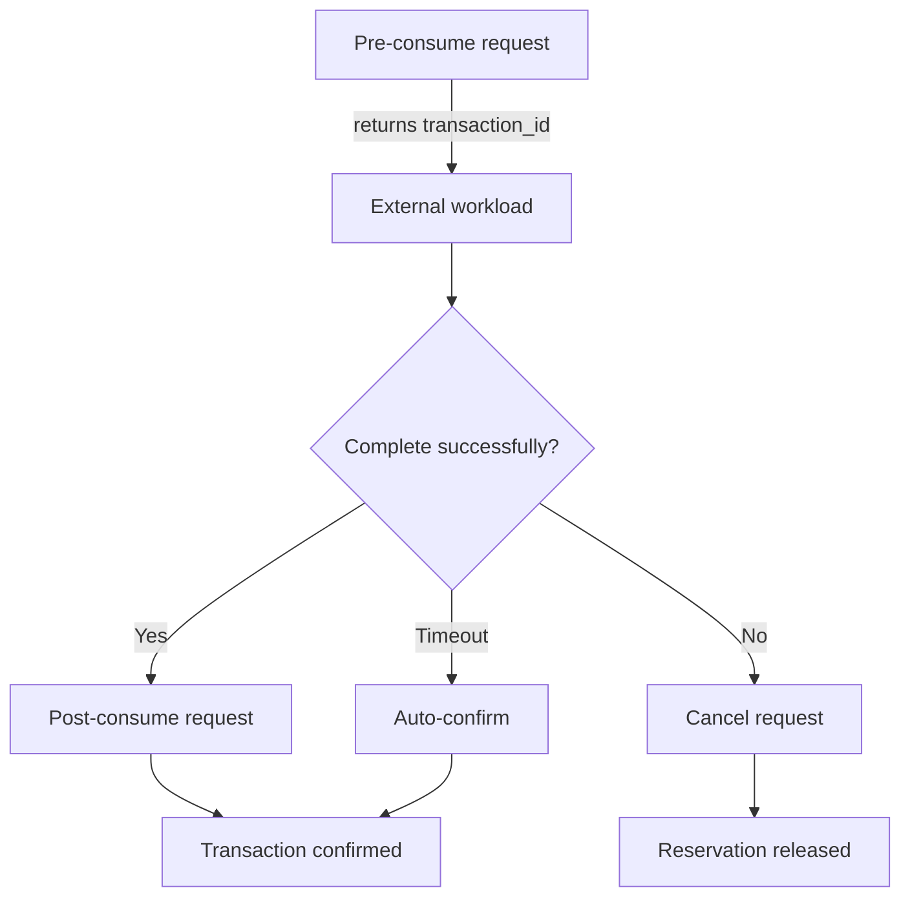

# External Billing Integration Guide

This guide explains how external services can report usage to One-API using the `/api/token/consume` endpoint. It covers the lifecycle of billing events, how transaction identifiers are managed, example requests, and integration best practices.

## Implementation Mapping

- All features described here are implemented in `controller/token.go` and `model/token_transaction.go`.
- Timeouts are clamped to project config: `EXTERNAL_BILLING_DEFAULT_TIMEOUT` and `EXTERNAL_BILLING_MAX_TIMEOUT` (see `common/config/config.go`).
- Legacy clients omitting `phase` are handled as `single` internally, performing pre and post in one step.
- Transaction records are stored in the `token_transactions` table (see migration in `model/main.go`).
- All quota changes and transaction events are logged for audit and reconciliation.

## Key Concepts

- **Transactions** – Each external billing event is tracked by a transaction stored in the `token_transactions` table. Transactions encapsulate both reservations and final reconciliations.
- **Consume phases** – One-API supports four phases:
  - `pre` – Reserve quota before an asynchronous job finishes.
  - `post` – Finalize a prior reservation with the authoritative usage total.
  - `cancel` – Release a pending reservation without charging quota.
  - `single` – Legacy shortcut that performs `pre` and `post` in a single call.
- **Transaction IDs** – One-API generates a unique transaction ID during `pre` and `single` phases and returns it in the response. Clients must supply that ID when issuing `post` or `cancel` calls.
- **Timeouts** – Each reservation has a configurable expiration window. If the timeout elapses with no `post` or `cancel`, One-API auto-confirms using the reserved amount.

**Timeouts are always clamped to the configured minimum and maximum. If a client requests a value outside this range, One-API will use the nearest allowed value.**

**Legacy clients (no `phase` field) are treated as `single` phase, which performs reservation and confirmation in one request.**

## Authentication

All examples assume you are calling One-API with a valid token. Replace `<ONE_API_TOKEN>` with your API key.

```text
Authorization: Bearer <ONE_API_TOKEN>
Content-Type: application/json
```

## End-to-End Flow (Pre → Post)

1. **Create reservation (`phase":"pre"`)**
2. **Run your workload**
3. **Finalize consumption (`phase":"post"`)**

### 1. Pre-Consume Reservation

```bash
curl -X POST https://one-api.example.com/api/token/consume \
  -H "Authorization: Bearer <ONE_API_TOKEN>" \
  -H "Content-Type: application/json" \
  -d '{
    "phase": "pre",
    "add_reason": "async-transcode",
    "add_used_quota": 150,
    "timeout_seconds": 600
  }'
```

**Successful response:**

```json
{
  "success": true,
  "message": "",
  "data": {
    "id": 1,
    "remain_quota": 9850,
    "unlimited_quota": false,
    "name": "transcode-token"
  },
  "transaction": {
    "transaction_id": "8ac38e33-6c7f-4059-9cb3-f6d32df29f35",
    "status": "pending",
    "pre_quota": 150,
    "expires_at": 1735694025,
    "auto_confirmed": false
  }
}
```

Store the `transaction.transaction_id` value. You must send it back when finishing or canceling the job.

### 2. Post-Consume Reconciliation

```bash
curl -X POST https://one-api.example.com/api/token/consume \
  -H "Authorization: Bearer <ONE_API_TOKEN>" \
  -H "Content-Type: application/json" \
  -d '{
    "phase": "post",
    "transaction_id": "8ac38e33-6c7f-4059-9cb3-f6d32df29f35",
    "add_reason": "async-transcode",
    "final_used_quota": 120,
    "elapsed_time_ms": 10875
  }'
```

`final_used_quota` may differ from the reservation. One-API refunds or consumes the delta automatically.

### Optional: Cancel a Pending Reservation

```bash
curl -X POST https://one-api.example.com/api/token/consume \
  -H "Authorization: Bearer <ONE_API_TOKEN>" \
  -H "Content-Type: application/json" \
  -d '{
    "phase": "cancel",
    "transaction_id": "8ac38e33-6c7f-4059-9cb3-f6d32df29f35",
    "add_reason": "async-transcode"
  }'
```

Cancellation refunds the reserved quota in full and marks the transaction as `canceled`.

## Single-Step Consumption (`phase":"single"`)

If you prefer a single request (for synchronous workloads), omit the `phase` field or set it to `"single"`:

```bash
curl -X POST https://one-api.example.com/api/token/consume \
  -H "Authorization: Bearer <ONE_API_TOKEN>" \
  -H "Content-Type: application/json" \
  -d '{
    "add_reason": "sync-generate",
    "add_used_quota": 35
  }'
```

The response includes a `transaction` object with status `confirmed` and the generated transaction ID for audit purposes.

## Request Payload Fields

| Field              | Required For     | Description                                                                                              |
| ------------------ | ---------------- | -------------------------------------------------------------------------------------------------------- |
| `phase`            | optional         | `"pre"`, `"post"`, `"cancel"`, or omitted/`"single"` for single-step billing.                            |
| `add_used_quota`   | `pre`, `single`  | Reservation amount in quota units. Also used as fallback during `post` if `final_used_quota` is missing. |
| `final_used_quota` | `post`           | Authoritative consumption amount. Optional; defaults to `add_used_quota`.                                |
| `add_reason`       | all phases       | Human-readable context stored in audit logs.                                                             |
| `transaction_id`   | `post`, `cancel` | ID returned from One-API during `pre`/`single`. Ignored for `pre`/`single` requests.                     |
| `timeout_seconds`  | optional (`pre`) | Overrides the auto-confirm window (clamped to project configuration).                                    |
| `elapsed_time_ms`  | optional         | Upstream processing latency captured in logs.                                                            |

## Flow Overview



## Error Handling & Retries

- **HTTP status 400** – Validation error (e.g., missing `transaction_id` on `post`). Fix the payload before retrying.
- **HTTP status 404** – Unknown token or transaction. Ensure you store the transaction ID returned from the `pre`/`single` response.
- **HTTP status 429/5xx** – Transient issues. Retry with backoff. The reservation remains until auto-confirmation.

## Best Practices

- Persist the transaction ID immediately after receiving it from the `pre`/`single` response.
- Call `post` (or `cancel`) before the timeout to avoid auto-confirming the reserved amount.
- Use `elapsed_time_ms` sparingly—only for completed jobs with reliable timing data.
- Monitor the transaction logs via the admin UI or database for auditing and reconciliation.
- Review architectural details in `docs/arch/api_billing.md` for deeper insight into pricing calculations and quota handling.

With this workflow, external systems can safely synchronize their usage with One-API while maintaining accurate quota accounting and audit trails.

## Additional Notes

- Transaction status codes: `pending`, `confirmed`, `auto_confirmed`, `canceled` (see `TokenTransactionStatus*` in code).
- Transaction IDs are unique per token and generated by One-API. Always persist and echo them for post/cancel.
- All error responses are wrapped and returned with context; see controller for details.
- For deeper architectural details, see `docs/arch/api_billing.md` and the code comments in `controller/token.go` and `model/token_transaction.go`.
